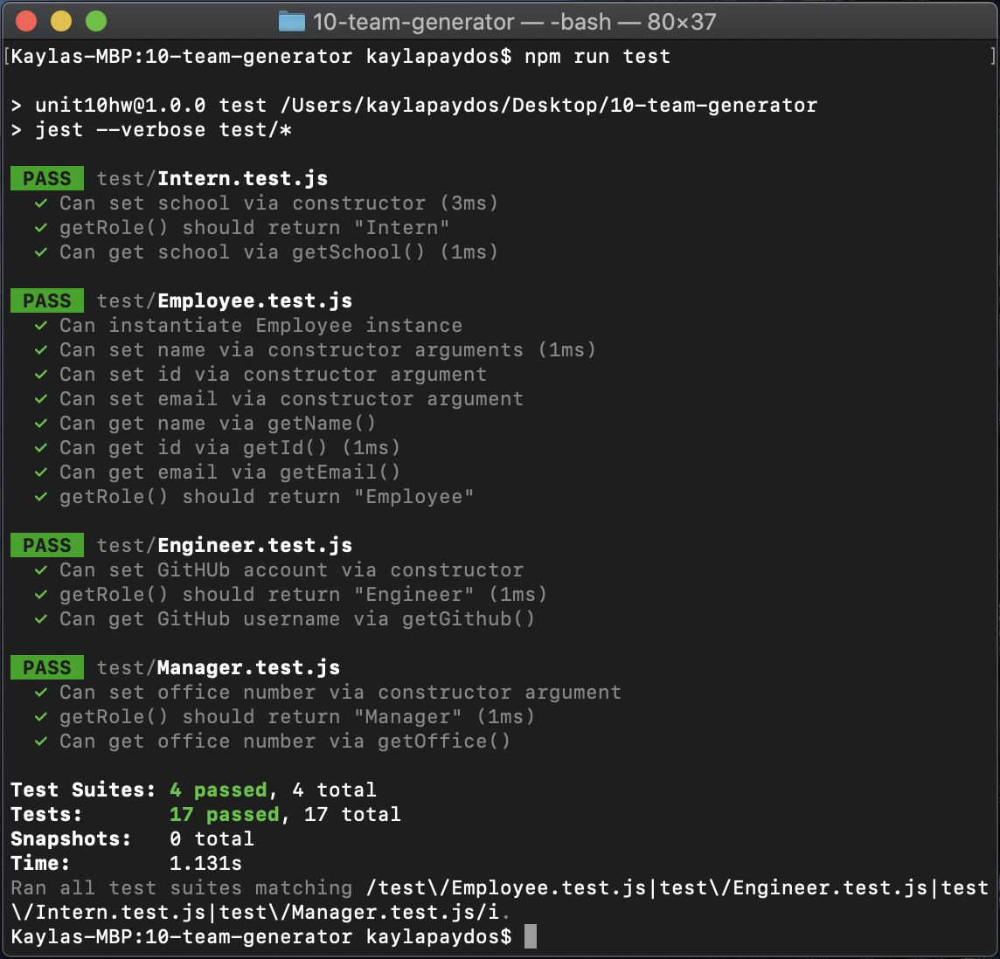

# Team Generator

<h2>Overview</h2>

**Goal:** Create a command-line application (CLI) that dynamically builds an HTML file displaying the team members of an engineering team from user inputs.

**Technologies Used:** JavaScript, jQuery, Node.js, NPM, Inquirer, Jest, HTML, CSS

**Contact:** <a href="mailto:kayla.dunphe@gmail.com">kayla.dunphe@gmail.com</a>

<h2>Video Demo</h2>
View the walkthrough video <a href="#">here</a>.

<h2>Screenshots</h2>

